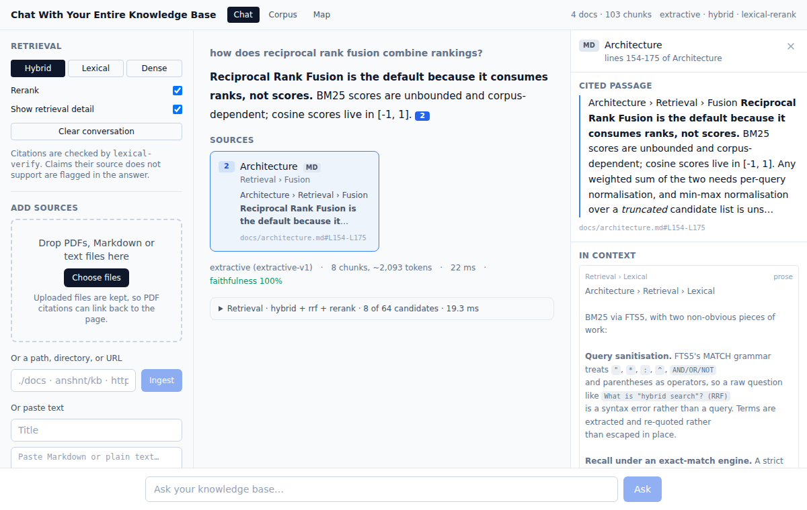
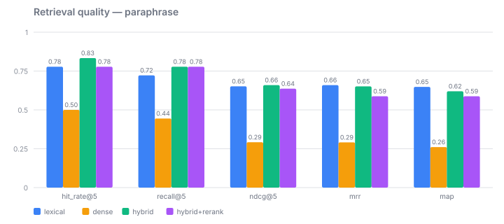
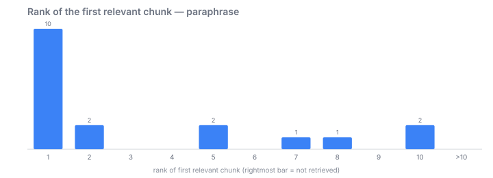
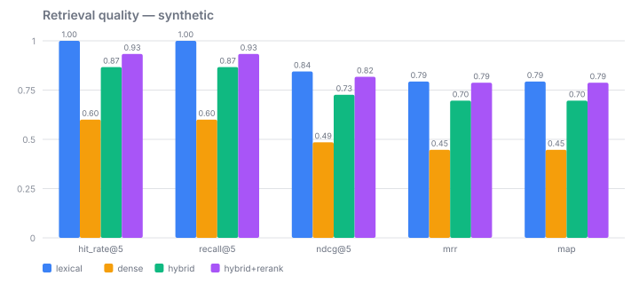
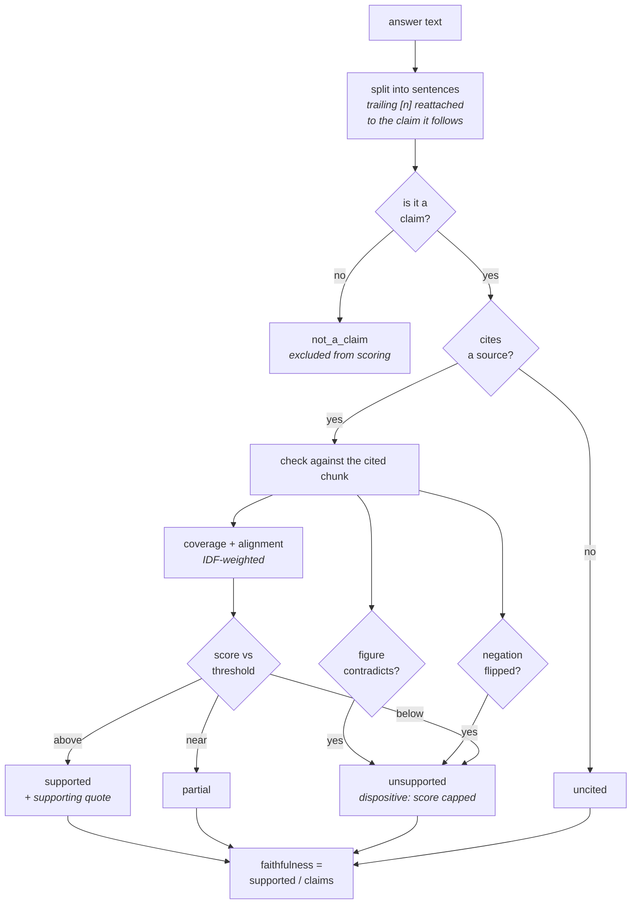
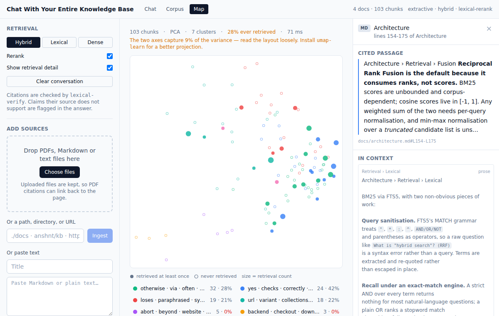
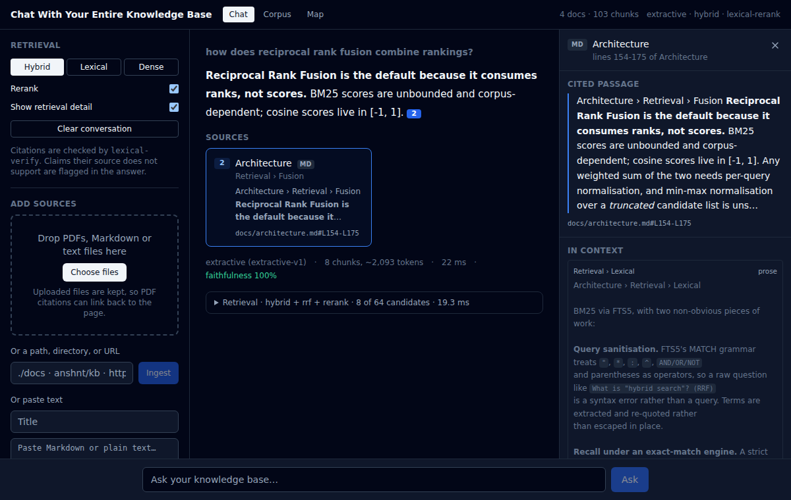
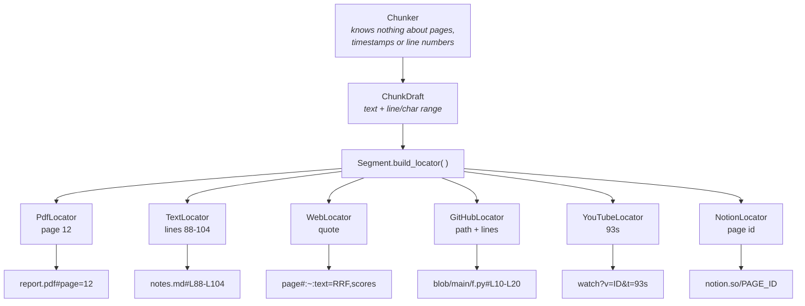
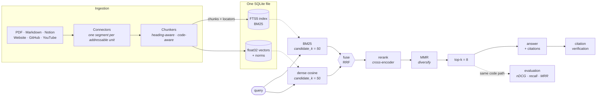
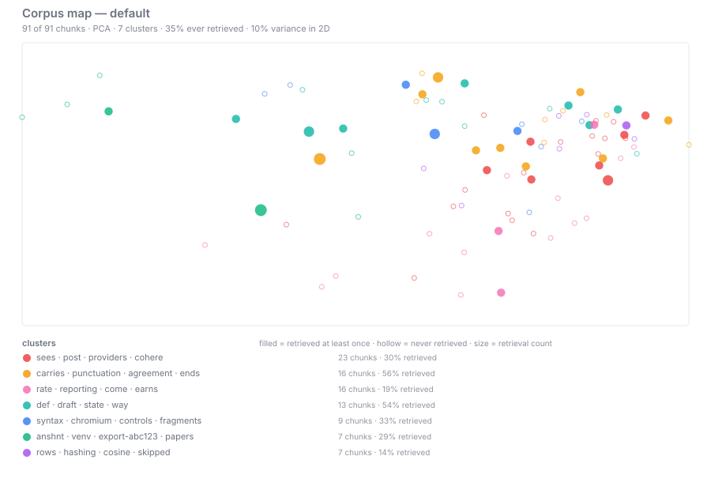

# Chat With Your Entire Knowledge Base

[](https://github.com/anshnt/Chat-With-Your-Entire-Knowledge-Base/actions/workflows/ci.yml)
[](pyproject.toml)
[](LICENSE)
[](tests)
[](#configuration)

Ask questions across PDFs, Markdown, Notion exports, websites, GitHub repos and
YouTube transcripts, and get answers whose citations **land on the exact page,
line, timestamp or line range they came from**.



This is not a RAG demo with a vector store and a prompt. The interesting parts
are the ones a demo skips:

| | What it does | Why it matters |
|---|---|---|
| **Hybrid search** | BM25 (SQLite FTS5) fused with dense cosine retrieval via Reciprocal Rank Fusion | Dense retrieval alone misses exact identifiers, error codes and rare terms; BM25 alone misses paraphrase. The chunk BM25 ranks 40th and the vectors rank 35th is often the right answer — and invisible to either at k=8 |
| **Reranking** | Four providers behind one interface: offline cross-feature, local cross-encoder, hosted (Cohere/Voyage), listwise LLM | Fusion optimises recall at k=50; the generator sees k=8. Reranking converts that recall into precision — and gives *discriminative* scores where RRF's are compressed |
| **Citation verification** | Every answer sentence is checked against the chunk it cites; wrong figures, contradictions and uncited claims are flagged | A citation nobody checked is decoration. Catches the failure that matters: a fluent paraphrase with a wrong number, cited to a real page |
| **Retrieval evaluation** | Recall@k, Precision@k, MRR, MAP, nDCG@k over a golden set, config sweeps, SVG reports | Without it every retrieval change is a vibe. With it, "hybrid beats dense" is a number — including when the number disagrees with you |
| **Document visualization** | 2D projection with auto-labelled clusters, a document similarity graph, and per-chunk retrieval counts | Shows what the corpus actually contains — and which parts of it no query has ever reached |

**It runs with no API keys.** The default embedder and generator are
deterministic local implementations, so `git clone && pytest` works offline and
CI needs no secrets. Point the config at Voyage/OpenAI/Anthropic when you want
real semantics — nothing else changes.

---

## Quickstart

```bash
git clone https://github.com/anshnt/Chat-With-Your-Entire-Knowledge-Base
cd Chat-With-Your-Entire-Knowledge-Base

python -m venv .venv && source .venv/bin/activate
pip install -e ".[dev]"

# Ingest anything
kb ingest ./docs                                  # directory, walked
kb ingest ~/papers/attention-is-all-you-need.pdf  # PDF, per-page citations
kb ingest ./Export-abc123                         # Notion export (or its .zip)
kb ingest https://example.com/docs --crawl        # website, same-origin crawl
kb ingest anshnt/kb --ref main                    # GitHub repo, code-aware
kb ingest 'https://youtu.be/VIDEO_ID'             # YouTube transcript

# Inspect the corpus
kb stats

# Search it
kb search "how does reciprocal rank fusion combine rankings?"

# Or ask it a question and get a cited answer
kb ask "why is a cross-encoder too slow to run over the whole corpus?"
```

`kb search` prints the fused ranking with the full score breakdown, so you can
see *why* each chunk is there:

```
1. 0.0328  Architecture › Retrieval › Fusion    architecture.md — lines 88-104
   bm25=6.9412@2 dense=0.7431@1 fused=0.0328
   RRF consumes ranks, not scores. BM25 scores are unbounded and corpus-…

2. 0.0161  Evaluation › Metrics                  evaluation.md — lines 12-31
   dense=0.6902@4 fused=0.0161
   nDCG rewards putting the most relevant chunk first, not merely…
```

## Answering

```console
$ kb ask "why is a cross-encoder too slow to run over the whole corpus?"

A cross-encoder reranker scores each query-document pair jointly, which is far
more accurate than comparing independent embeddings, but too slow to run over a
whole corpus. [1]

[1]  Retrieval Augmented Generation — Reranking
     docs/rag.md#L9-L11

extractive (extractive-v1) · 3 chunks, ~150 tokens · 4.7ms
```

Every `[n]` resolves to a source position with a working deep link. Three
properties make that claim mean something:

**Hallucinated markers never render.** The model's output is untrusted: markers
are validated against the sources actually supplied, and an invented `[9]` is
stripped from the text rather than shown as a dead chip. A citation that leads
nowhere is worse than no citation, because it looks like evidence.

**Citations attach to the right sentence.** Citations are written *after* the
claim they support — `…defaults to 60. [1]` — so a naive sentence split
attributes the marker to the *next* sentence. Since verification runs per
sentence, that misattribution would make every verdict meaningless, so the
splitter reattaches trailing markers to the claim they follow.

**Off-corpus questions are refused, not answered.** Ask about the capital of
France against a retrieval corpus and you get "the sources do not contain an
answer" — not a confident, fully-cited answer stitched from whatever ranked
highest. That is the single most damaging thing a grounded system can do.

### Providers

| `KB_GENERATION_PROVIDER` | What it does | Needs |
|---|---|---|
| `extractive` *(default)* | Selects the sentences from retrieved chunks that answer the question, cites each to its chunk | nothing |
| `anthropic` / `openai` | Writes prose from the numbered sources, with streaming | an API key |

The extractive generator is the default for a reason beyond convenience: every
sentence is **verbatim from a source**, so it is trivially faithful — there is no
mechanism by which it can hallucinate. That makes it a safe fallback (a provider
outage degrades to it without risking an unsupported claim), a deterministic
fixture for citation-verification tests, and a genuine floor for the evaluation
harness to measure an LLM *against*.

Sentence selection is MMR — relevance minus redundancy — because without the
redundancy term an extractive answer becomes the same fact restated from four
overlapping chunks.

Streaming is available over SSE at `POST /api/ask/stream`; citations arrive with
the terminal `done` event, since a marker can be half-emitted mid-stream.

## Retrieval evaluation

```bash
kb eval generate -o eval/golden.yaml       # bootstrap a golden set from the corpus
kb eval run eval/golden.yaml --sweep full  # compare configurations
```

Same questions, same corpus, one variable changed. Measured against **this
repository's own documentation** with the default offline embedder:



| configuration | hit_rate@5 | recall@5 | ndcg@5 | mrr | mean ms |
|---|---|---|---|---|---|
| lexical (BM25) | 0.778 | 0.722 | 0.652 | **0.659** | 2.4 |
| dense | 0.500 | 0.444 | 0.292 | 0.291 | 3.1 |
| **hybrid** | **0.833** | **0.778** | **0.659** | 0.651 | 7.3 |
| hybrid + rerank | 0.778 | 0.778 | 0.636 | 0.588 | 15.4 |

The histogram of *where* the first relevant chunk landed is the most diagnostic
single artefact — a tail at ranks 8-10 blames the reranker, a spike in the
rightmost bar blames retrieval:



### The interesting part is where the numbers disagree with the pitch

Those figures come from a **hand-written** golden set whose questions are
deliberately worded *differently* from the passages that answer them. Run the
same sweep against a set **generated from the corpus** and the ranking inverts:



| configuration | generated: hit_rate@5 | generated: ndcg@5 | paraphrase: hit_rate@5 | paraphrase: ndcg@5 |
|---|---|---|---|---|
| lexical | **1.000** | 0.844 | 0.778 | 0.652 |
| dense | 0.600 | 0.485 | 0.500 | 0.292 |
| hybrid | 0.867 | 0.726 | **0.833** | **0.659** |
| hybrid + rerank | 0.933 | **0.818** | 0.778 | 0.636 |

Three conclusions, none of them flattering by default:

1. **A synthetic golden set measures vocabulary, not quality.** Questions derived
   from a corpus inherit its wording, so BM25 scores a perfect 1.000 hit rate and
   hybrid *loses* to it. Any project reporting only synthetic numbers is reporting
   how well its retriever matches strings it was handed.
2. **Hybrid earns its keep on recall, not on ranking.** On paraphrased questions
   it gains 0.055 hit rate and 0.056 recall over BM25 while nDCG barely moves.
   That is the expected shape: fusion surfaces chunks BM25 never returns, and
   ordering them is the reranker's job.
3. **The offline reranker helps on one set and hurts on the other**, +0.092 nDCG
   vs −0.023, for a legible reason: it scores term coverage, proximity and exact
   phrase — exactly the signals a paraphrased question *lacks*. That measurement
   is the argument for `KB_RERANK_PROVIDER=cross_encoder` in real use, and it is
   not knowable without measuring.

Full write-up, metric definitions, and the four decisions that keep the numbers
honest (excluded-not-zeroed queries, capped recall denominators, achievable nDCG
ceilings): [`docs/evaluation.md`](docs/evaluation.md).

```bash
kb eval run eval/golden-paraphrase.yaml --metric ndcg@5 --fail-under 0.55
```

Exits non-zero below the threshold, so a retrieval regression fails the build
instead of being discovered in production.

## Citation verification

The failure this exists to catch is not a model inventing nonsense. It is a model
**correctly completing a fact that is not in the corpus** and attaching a
citation to a chunk that does not say it. The answer reads perfectly, the chip
links to a real page, and the claim is unsourced. No amount of retrieval quality
prevents that — only checking does.

So every sentence of the answer is checked against the chunk it cites, and the
verdict is reported *per sentence*, because an answer is not uniformly true or
false:

| Verdict | Meaning |
|---|---|
| `supported` | The cited chunk states the claim |
| `partial` | The chunk is related but does not fully state it |
| `unsupported` | The chunk does not support the claim — the citation is wrong |
| `uncited` | The sentence makes a factual claim and cites nothing |
| `not_a_claim` | Framing, transitions, questions — nothing to verify |

Real output from the offline verifier against a source that says *"The damping
constant k defaults to 60"*:

| Claim | Verdict | Score | Why |
|---|---|---|---|
| …defaults to 60. `[1]` | `supported` | 1.00 | quotes the source sentence |
| …defaults to **50**. `[1]` | `unsupported` | 0.12 | *"the supporting sentence states a different figure: claim says 50, source says 60"* |
| …defaults to **77**. `[1]` | `unsupported` | 0.08 | figure absent from the source entirely |
| A reranker **does not** support joint scoring. `[1]` | `unsupported` | 0.12 | claim and source disagree on negation |
| …defaults to 60 in every implementation. | `uncited` | 0.00 | a factual claim citing nothing |
| Here is what the sources say: | `not_a_claim` | — | excluded from scoring |



`faithfulness` is the share of *claim* sentences that come out supported.
`not_a_claim` sentences are excluded from the denominator — a faithfulness metric
you can raise by adding filler is worthless.

### What the offline verifier actually checks

No API key, no NLI model, deterministic:

1. **IDF-weighted content coverage** of the claim against the chunk.
2. **Best-sentence alignment**, which becomes the `supporting_quote`.
   Verification without a quote is an opinion; with one, a reader checks it in a
   glance.
3. **Number agreement** — the highest-value check here, because the
   characteristic RAG failure is a fluent paraphrase with a wrong figure, and it
   scores near-perfectly on word overlap. Sentence-scoped, not chunk-scoped: a
   claim of "50" against a chunk that says "defaults to 60" *and*, elsewhere,
   "recall at 50" is still caught.
4. **Negation agreement** — a claim and a chunk that disagree on negation share
   almost every word. Contrast is distinguished from negation, so "combines
   ranks, **not** raw scores" and "combines ranks **rather than** raw scores" are
   correctly read as agreeing.

Number contradictions and negation flips are treated as **gates, not scores**:
they cap the support score below the unsupported boundary, so a wrong figure
stays unsupported however lenient your threshold.

What it cannot catch: a genuine semantic inference, and a paraphrase with no
lexical overlap. Both push the score *down*, so the failure mode is a false
"unsupported" rather than a false "supported" — the safe direction. Set
`KB_VERIFY_PROVIDER=llm` for a strict entailment judge that is required to quote
its evidence and defaults to "no" when unsure.

## Reranking

Fusion maximises recall over 50 candidates; the answer only ever sees 8. The
reranking stage is what turns the former into the latter, and it is the highest-
leverage single addition to a naive pipeline — a cross-encoder reads the query
and the passage *together*, so it can judge relevance in ways that comparing two
independently-computed embeddings structurally cannot.

Four providers behind one interface:

| `KB_RERANK_PROVIDER` | What it is | Needs |
|---|---|---|
| `lexical` *(default)* | Offline query-passage features: IDF-weighted coverage, proximity, exact phrase, first-match position, heading match | nothing |
| `cross_encoder` | Local `ms-marco-MiniLM` cross-encoder, ~90 MB, CPU-friendly | `pip install 'kb-chat[local]'` |
| `cohere` / `voyage` | Hosted rerank APIs | an API key |
| `llm` | Listwise: the model sees all candidates and orders them, so it can make *comparative* judgements | an API key |

A reranker that fails, times out, or returns a malformed ordering degrades to the
fused order rather than failing the query — the candidates were already relevant,
just less well sorted. A missing optional dependency or API key falls back to the
offline reranker with a warning.

The second-order benefit is score quality. RRF scores are compressed by
construction (rank 1 vs rank 2 differ by ~1.6%), which makes a `min_score`
threshold useless. Rerank scores separate:

```
fusion only:   0.0164  0.0161  0.0159    ← which of these is actually right?
+ reranking:   1.7448  0.8685  0.6778    ← the first one
```

`kb eval` (see [`docs/evaluation.md`](docs/evaluation.md)) is how you decide
whether a hosted reranker earns its latency on *your* corpus, rather than taking
a benchmark's word for it.

## Web interface

```bash
kb serve                              # the API on :8000
cd frontend && npm install && npm run dev   # the UI on :5173
```

Three panes: retrieval controls and ingestion on the left, the conversation in
the middle, and **the source** on the right. That last one is the point — a
citation has to land somewhere, and if checking a claim means leaving the page,
most readers will not.

| | |
|---|---|
|  |  |

Four decisions worth naming:

**Verdicts render on the sentence, not in a panel.** A list of "3 unsupported
claims" under an answer is something a reader skips. A wavy underline under the
actual clause is not. And `supported` sentences get **no** decoration —
highlighting the normal case draws the eye away from the exceptions, which are
the only reason the feature exists. Colour is never the only signal: each verdict
has a distinct underline style and a word, so it survives colour blindness and
greyscale.

**A citation marker is a real `<button>`.** Markers are the primary navigation
here, so they are keyboard-reachable and their labels say where they go
("Citation 2: Architecture — Retrieval › Fusion") rather than reading out "[2]".
The answer is rendered as React elements, never `dangerouslySetInnerHTML` —
routing model output through an HTML sink would be the obvious way to put an XSS
hole in an otherwise safe app.

**A link that would not resolve is not rendered as a link.** A `TextLocator` for
a local Markdown file produces `docs/architecture.md#L154`, which is a fine
address for an editor and a dead link in a browser. Showing it anyway is exactly
the failure this project criticises elsewhere, so the UI checks first and shows
the passage instead.

**The retrieval knobs are in the UI on purpose.** Asking the same question under
`hybrid`, `lexical` and `dense`, with the per-stage scores visible, is how you
develop an intuition for what fusion is actually doing — and how you tell a
generation problem from a retrieval one.

No charting or Markdown dependency: the corpus map is ~200 lines of hand-drawn
SVG, and answer text goes through a ~60-line inline-Markdown tokeniser, because
the extractive generator quotes source sentences verbatim and a sentence lifted
from a Markdown file arrives with its `**bold**` intact.

## HTTP API

```bash
kb serve            # http://localhost:8000, docs at /docs
```

| Endpoint | Purpose |
|---|---|
| `POST /api/ingest` | Ingest a source path/URL, or paste text directly |
| `POST /api/ingest/upload` | Upload a file |
| `POST /api/ask` | Answer a question with validated citations |
| `POST /api/ask/stream` | The same, streamed as Server-Sent Events |
| `POST /api/search` | Hybrid retrieval with full score provenance |
| `GET /api/documents` | Browse the corpus |
| `GET /api/documents/{id}/chunks` | Inspect how a document was chunked |
| `GET /api/chunks/{id}/context` | Neighbouring chunks, for the source viewer |
| `GET /api/collections/{name}/stats` | Corpus statistics |
| `GET /api/collections/{name}/heatmap` | Which chunks actually get retrieved |
| `GET /api/collections/{name}/queries` | Recently issued queries, for mining eval questions |

## How citations jump to the source

Every chunk stores a typed `Locator`, and each variant knows how to address
itself:

| Source | Locator | Deep link |
|---|---|---|
| PDF | page (+ char span) | `report.pdf#page=12` |
| Markdown / text | line range + heading path | `notes.md#L88-L104` |
| Website | URL + quote | `example.com/page#:~:text=RRF%20consumes,not%20scores` |
| GitHub | repo, ref, path, lines | `github.com/o/r/blob/main/f.py#L10-L20` |
| YouTube | video id + start time | `youtube.com/watch?v=ID&t=93s` |
| Notion export | page path + line range | page URL |



Adding a source type means adding a `Locator` variant and a connector. Nothing
in chunking, retrieval or generation changes — they never learn what a page is,
because they only ever call `locator.deep_link()`.

Each connector does the work that source type actually needs, rather than calling
`.get_text()` and hoping:

| Source | The part that is not just parsing |
|---|---|
| **PDF** | One segment per page, so a chunk never straddles a page boundary. De-hyphenation (`retriev-\nal` → `retrieval`, or neither BM25 nor the embedder ever matches the word), and header/footer removal by frequency across pages rather than by position |
| **Website** | Content selected by **text density** — the ratio of text to markup, since navigation is link-dense and text-sparse. Converted to Markdown, not plain text, so the heading structure survives into citation labels. `robots.txt` respected |
| **GitHub** | Code chunked at **top-level declarations**, with the enclosing symbol on the locator: `fusion.py:88 (reciprocal_rank_fusion)`. Lock files, `node_modules` and minified bundles excluded |
| **YouTube** | Grouped into **time windows**, because auto-captions have no punctuation for a text chunker to split on. Overlap measured in seconds, so the repeated span is real speech |
| **Notion** | The 32-hex page id split out of the filename (kept, so citations link to `notion.so`), directory nesting reconstructed into `Engineering › Runbooks › On-call`, and CSV databases turned into `key: value` blocks — a raw row loses its field names and embeds terribly |

See [`docs/connectors.md`](docs/connectors.md). `kb connectors` lists what your
install can ingest.

## Architecture



Two candidate lists of 50 are fused and **only then** cut to 8 — the chunk BM25
ranks 40th and the vectors rank 35th is often the right answer, and it is
invisible to either retriever alone at k=8.

One SQLite file holds documents, chunks, the BM25 index and the vectors, so the
lexical and dense views of the corpus can never drift apart. The evaluation
harness runs through the *same* pipeline that serves a live query, which is the
only way a retrieval benchmark means anything. See
[`docs/architecture.md`](docs/architecture.md).

## Corpus visualization

```bash
kb map -o corpus-map.svg
```



Every chunk projected to 2D, k-means clustered, each cluster labelled
automatically. **Filled dots have been retrieved at least once; hollow ones never
have** — outline rather than colour, so it survives greyscale and colour
blindness, and it is exactly the distinction the map exists to show. Point size
is retrieval count on a log scale.

```
91 of 91 chunks · PCA · 7 clusters · 35% ever retrieved · 77 ms

 cluster  chunks  retrieved  distinctive terms
       0       9        33%  syntax · chromium · controls · fragments
       3       7        14%  rows · hashing · cosine · skipped
       ...
3 cluster(s) have never been retrieved — redundant, or unreachable by how people actually ask
```

Three deliberate choices:

**Cluster labels are contrast terms, not frequent terms.** "Most common words in
the cluster" gives you *"the, and, retrieval"* for every cluster. These come from
log-odds with a Dirichlet prior — frequent *inside* the cluster and rare
*outside* it — which is why they read as `sqlite · float32 · heatmap` and
`githublocator · notionlocator · pdflocator`. A term appearing in only one chunk
is excluded, so a single verbose passage cannot name a whole region.

**PCA is a first-class fallback, and says so.** UMAP is preferred, then t-SNE, then
a ~30-line numpy PCA — because a map that exists beats a perfect map that
doesn't. When PCA runs, the response reports `explained_variance` and the CLI
warns when it is low: *"the two axes capture 10% of the variance — read the
layout loosely"*. Every projection is seeded and the PCA sign convention is
fixed, so the map is comparable across runs instead of mirroring at random.

**The document graph answers what the scatter plot can't.** Which *documents*
overlap — near-duplicates, a doc and its changelog, the same runbook exported
twice. Those are the documents competing for the same top-k slot, so finding them
is actionable.

| Endpoint | Question it answers |
|---|---|
| `GET /api/collections/{c}/map` | Where is everything, and what is each region about? |
| `GET /api/collections/{c}/graph` | Which documents overlap? |
| `GET /api/collections/{c}/coverage` | How much of the corpus does any work — and which chunks never do? |

## Configuration

Every setting is an environment variable with the `KB_` prefix (see
[`.env.example`](.env.example)):

```bash
KB_EMBEDDING_PROVIDER=voyage      # hashing (default, offline) | voyage | openai | local
KB_RETRIEVAL_STRATEGY=hybrid      # hybrid | dense | lexical
KB_FUSION_METHOD=rrf              # rrf | weighted | max
KB_TOP_K=8
KB_CANDIDATE_K=50                 # candidates per retriever before fusion
KB_USE_MMR=true                   # diversify the final set

KB_RERANK_PROVIDER=cross_encoder  # lexical (default, offline) | cross_encoder | cohere | voyage | llm
KB_RERANK_TOP_N=30                # candidates handed to the reranker

KB_GENERATION_PROVIDER=anthropic  # extractive (default, offline) | anthropic | openai
KB_CONTEXT_TOKEN_BUDGET=6000      # tokens of retrieved context in the prompt

KB_VERIFY_PROVIDER=llm            # lexical (default, offline) | llm | none
KB_VERIFICATION_THRESHOLD=0.5     # support score below which a claim is unsupported
```

## Development

```bash
make test        # pytest, offline, no keys required — 584 tests
make lint        # ruff + mypy
make check       # both
make eval        # ingest this repo's docs and run the paraphrase sweep
```

## License

MIT — see [LICENSE](LICENSE).
